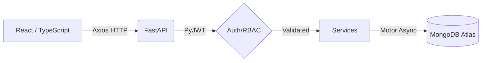

# FinTrack – Personal Finance Analyzer


## Overview
**FinTrack** is a highly modular, full-stack personal finance platform designed to provide users granular control over their transactions, budgets, goals, and analytics. 

It pairs a robust, asynchronous **FastAPI** backend with a modern, responsive **React (Vite + TypeScript)** frontend. The architecture heavily emphasizes clean RESTful design, granular Role-Based Access Control (RBAC), secure JWT authentication, and isolated ownership boundaries leveraging **MongoDB Atlas**.

## Why FinTrack?
Managing personal finances at scale requires both lightning-fast UI responsiveness and uncompromised backend security. FinTrack uniquely combines real-time asynchronous database interactions (via Motor) with enterprise-grade aggregation pipelines, ensuring instantaneous analytics tracking without breaking a sweat. It proves that personal projects can adhere strictly to professional SaaS engineering standards.

## Key Features
- **JWT Authentication:** Stateful Access and Refresh token rotation.
- **Role-Based Access Control (RBAC):** Native enforcement of 6 unique user roles across endpoints.
- **Intelligent Transactions:** Full CRUD capabilities with real-time categorizations.
- **Budgeting & Goals:** Track expenditures against set thresholds and calculate pacing dynamically.
- **High-Performance Analytics:** Complex MongoDB aggregation pipelines mapped safely to isolated user boundaries.
- **Modern UI:** Built on React 18, Vite, and TypeScript with fluid responsiveness.

---

## Application Architecture

### Technology Stack
- **Backend**: FastAPI, Python 3.11, PyMongo/Motor (Async), Pydantic V2, PyJWT, Bcrypt
- **Database**: MongoDB Atlas
- **Frontend**: React, Vite, TypeScript, Axios, React Router v6

### Data Flow


---

## Role-Based Access Control
The application natively supports six strictly enforced roles directly within the FastAPI dependency injection layer:

| Role              | Access                               |
| ----------------- | ------------------------------------ |
| **Super Admin**   | Full system administration and bypass rules |
| **Admin**         | User role promotion and system monitoring   |
| **Financial Advisor**| Authorized read-only views for advisory |
| **Premium User**  | Core tracking plus advanced extended reporting |
| **Free User**     | Core financial tracking (Budgets, Transactions, Goals) |
| **Auditor**       | High-level aggregated read-only financial compliance |

*Note: Roles are strictly isolated. User A can never query User B's transactions or budgets, regardless of their role unless explicitly configured by a Super Admin.*

---

## Project Structure

| File/Directory   | Purpose                         |
| ---------------- | ------------------------------- |
| `app/main.py`      | FastAPI ASGI application entry point |
| `app/api/`         | Granular REST API endpoint routers |
| `app/core/`        | Environment, security config, and JWT logic |
| `app/database/`    | Motor Async MongoDB connection pooling |
| `app/models/`      | Domain entities and Pydantic representations |
| `app/schemas/`     | Strict Pydantic validation schemas (Input/Output) |
| `app/services/`    | Isolated business logic and DB abstractions |
| `frontend/src/`    | Vite React TypeScript frontend |
| `tests/`           | Pytest automated test suites |
| `requirements.txt` | Python backend dependencies |
| `pytest.ini`       | Pytest async configuration |

---

## Setup Guide

### 1. Prerequisites
- Python 3.9+
- Node.js 18+
- MongoDB Atlas Cluster

### 2. Environment Setup
Create a `.env` file in the root directory:
```env
MONGODB_URL=mongodb+srv://<username>:<password>@cluster.mongodb.net/
DATABASE_NAME=fintrack
JWT_SECRET_KEY=your_secure_256bit_secret
```

### 3. Start the Backend
```bash
# Install dependencies
pip install -r requirements.txt

# Start the uvicorn development server
uvicorn app.main:app --reload
```
*The backend API documentation will be available at `http://localhost:8000/docs`.*

### 4. Start the Frontend
```bash
cd frontend
npm install
npm run dev
```
*The React UI will be available at `http://localhost:5173`.*

---

## Security
- **No Secrets in Source:** `.env` files and credentials are strictly ignored via `.gitignore`.
- **Passwords:** All passwords are conservatively hashed with `bcrypt`.
- **Sessions:** Stateless stateless JSON Web Tokens. Refresh tokens are verified securely against the database and rotated securely.
- **CORS:** Controlled dynamically via FastAPI middleware blocking untrusted cross-origin origins.

---

## Testing
The backend utilizes Pytest layered dynamically over `mongomock_motor` to ensure robust, isolated, non-destructive execution without exposing live Atlas configurations.

```bash
pytest -v
```

---

